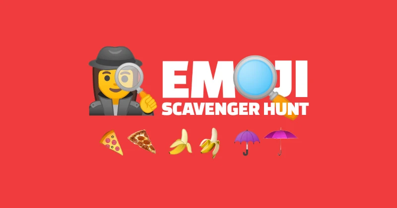

# EmojiNet

[](https://github.com/huan/emoji-net/actions/workflows/npm.yml)
[](https://www.npmjs.com/package/emoji-net)
[](https://www.npmjs.com/package/wechaty-puppet-whatsapp?activeTab=versions)
[](https://www.tensorflow.org/js)

EmojiNet is an image to emoji recognizer based on MobileNet / Google Emoji Scavenger Hunt.



> Image source: [Emoji Scavenger Hunt](https://emojiscavengerhunt.withgoogle.com)

## Introduction

This model is based on TensorFlow.js / MobileNet and it does not require you to know about machine learning.
It can take as input any local file and returns an array of most likely predictions of emoji the image contains.

## Usage

There are two main ways to get this model in your JavaScript project: via script tags or by installing it from NPM and using a build tool like Parcel, WebPack, or Rollup.

### via Script Tag

Not supported yet.

Pull Requests are welcome!

### via NPM

```js
import { EmojiNet } from 'emoji-net'

const emojinet = new EmojiNet()

// Load the model and warm it up
await emojinet.load()

// recognize the image.
const emojiItemList = await emojinet.recognize('tests/fixtures/sofa.jpg')
console.log('emojiItemList:', emojiItemList)
// Output:
// emojiItemList: [
//   { id: 416, name: 'sofa', probobility: 0.9893624782562256 },
//   { id: 61, name: 'bed', probobility: 0.007496606558561325 },
//   { id: 241, name: 'wallet', probobility: 0.000651892158202827 }
// ]
```

## API

### `new EmojiNet()`

Create a EmojiNet instance.

```ts
const emojinet = new EmojiNet()
```

### `emojinet.load()`

Load the modle and warm it up.

```ts
await emojinet.load()
```

### `emojinet.recognize()`

```ts
const emojiItemList = await emojinet.recognize('tests/fixtures/sofa.jpg')
console.log('emojiItemList:', emojiItemList)
// Output:
// emojiItemList: [
//   { id: 416, name: 'sofa', probobility: 0.9893624782562256 },
//   { id: 61, name: 'bed', probobility: 0.007496606558561325 },
//   { id: 241, name: 'wallet', probobility: 0.000651892158202827 }
// ]
```

### `emojinet.dispose()`

Free the resources.

```ts
emojiNet.dispose()
```

## Inspired By: Emoji Scavenger Hunt

- [A look at how we built the Emoji Scavenger Hunt using TensorFlow.js, Jacques Bruwer, JK Kafalas, and Shuhei Iitsuka, Google Brand Studio, Oct 11, 2018](https://medium.com/tensorflow/a-look-at-how-we-built-the-emoji-scavenger-hunt-using-tensorflow-js-3d760a7ebfe6)

### About MobileNet

MobileNets are small, low-latency, low-power models parameterized to meet the resource constraints of a variety of use cases. They can be built upon for classification, detection, embeddings and segmentation similar to how other popular large scale models, such as Inception, are used.

MobileNets trade off between latency, size and accuracy while comparing favorably with popular models from the literature.

For more information about MobileNet, check out this readme in
[tensorflow/models](https://github.com/tensorflow/models/blob/master/research/slim/nets/mobilenet_v1.md).

## History

### main

### v0.2 (Aug 20, 2021)

First working version.

### v0.0.1 (Aug 19, 2021)

Initial version.

Most of the code are copy/pasted from [Google Emoji Scavenger Hunt](https://github.com/google/emoji-scavenger-hunt):

> an experiment that leverages the power of neural networks and your phone’s camera to identify the real world versions of the emojis we use every day

## Author

[Huan LI](https://github.com/huan) ([李卓桓](http://linkedin.com/in/zixia)), [Google Developers Expert in Machine Learning (ML GDE)](https://developers.google.com/community/experts/directory/profile/profile-huan-li), zixia@zixia.net

[](https://stackexchange.com/users/265499)

## Copyright & License

- Docs released under Creative Commons
- Code released under the Apache-2.0 License
- Code & Docs © 2021 Huan LI \<zixia@zixia.net\>
